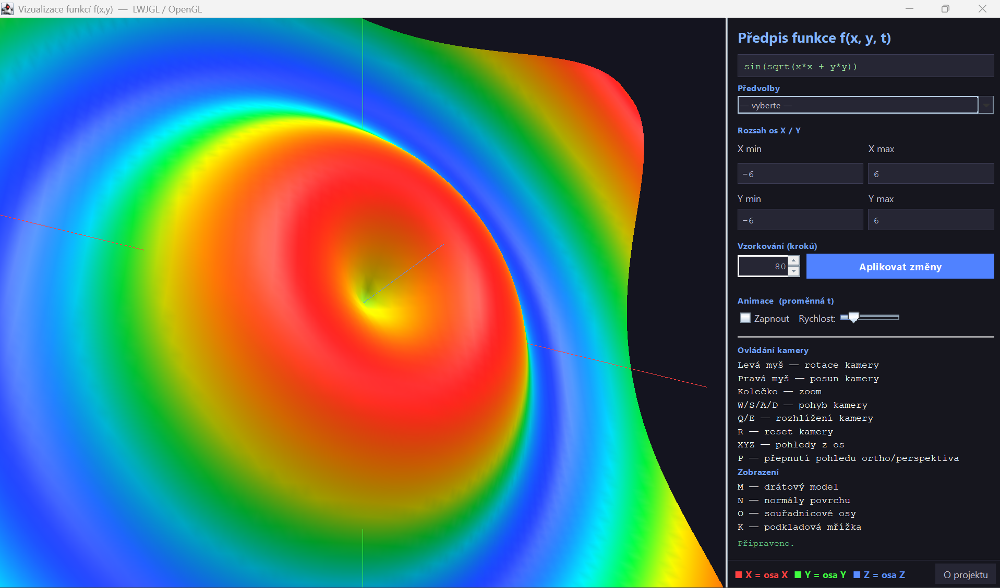

# 3D Math Functions

**Type in a math formula and see it as an interactive 3D surface that you can rotate, zoom and animate.**

<p>
  
</p>

**[⬇ Download for Windows](https://github.com/lenka-sediva/math-functions/releases/latest)** (no installation and no Java needed)

> **Windows may warn you:** "Windows protected your PC" / "Unknown publisher". This appears for every new app
> that is not code-signed (signing costs money); it doesn't mean the app is harmful. Click **More info → Run anyway**.
> The source code is fully open, and release files are [built automatically by GitHub Actions](https://github.com/lenka-sediva/math-functions/actions)
> straight from this repository. [How to verify the download](#verify-the-download).

---

## Features

- **Any formula `f(x, y, t)`**: e.g. `sin(x) * cos(y)` or `exp(-(x*x+y*y)/4)`, with 24 built-in functions
- **10 ready-made presets**: ripple, saddle, Mexican hat, spiral and more
- **Animation** over time (variable `t`) with adjustable speed
- **Free camera**: orbit, pan and zoom with the mouse, plus quick views from the X/Y/Z axes
- **Perspective / orthographic** projection
- **Display modes**: lit surface with a height-based color gradient, wireframe, surface normals, axes, grid
- **Adjustable detail**: 10–300 grid steps and a custom X/Y range
- **Input validation**: clear error messages for invalid formulas or ranges

## Tech Stack

| Area      | Technology                                           |
|-----------|------------------------------------------------------|
| Language  | Java 21                                              |
| Graphics  | OpenGL (fixed-function pipeline) via **LWJGL 3**     |
| Windowing | GLFW (render window) + Java Swing (control panel)    |
| Build     | Maven, `jpackage` (Windows app with a bundled JRE)   |
| CI/CD     | GitHub Actions → GitHub Releases                     |

## What I learned / Technical highlights

- **A math expression parser written from scratch**: tokenizer → **Shunting-yard algorithm** → postfix (RPN) evaluation. It handles operator precedence, right-associative `^`, unary minus and multi-argument functions (`atan2`, `pow`, `min`, `max`). The formula is compiled once and then evaluated up to ~90,000 times per frame during animation.
- **Mesh generation**: the function is sampled on an N×N grid and triangulated. **Normals are computed from partial derivatives** (central differences) to give smooth lighting. Undefined values (`NaN`, division by zero) are handled without crashing.
- **Lighting and color**: two light sources (a warm key light and a cool fill light), a specular material and a height-based color map.
- **Two UI toolkits working together**: a borderless GLFW OpenGL window runs on its own thread and is kept exactly aligned over a Swing layout. Thread-safe communication goes through `volatile` state, because the GLFW API is not thread-safe.
- **3D camera math**: an orbit camera using spherical coordinates (azimuth/zenith/radius), plus perspective and orthographic projection.
- **Screenshots from the GPU**: `glReadPixels` → PNG. The PNG is encoded off the render thread so the app doesn't stutter.
- **Distribution**: a Maven build, a self-contained Windows app made with `jpackage`, and an automated release pipeline in GitHub Actions.

## How to run

### Easiest: Windows
1. Download **`MathFunctions3D-windows.zip`** from the [latest release](https://github.com/lenka-sediva/math-functions/releases/latest).
2. Unzip it and double-click **`MathFunctions3D.exe`**.
3. If Windows SmartScreen shows a warning, click **More info → Run anyway**. The app is not code-signed.

### If you have Java 21+ installed
Download `math-functions-all.jar` from the same release and run it (no SmartScreen warning):
```
java -jar math-functions-all.jar
```

### Verify the download
Each release includes a `SHA256SUMS.txt` file. In the folder with the downloaded file, run:
```
certutil -hashfile MathFunctions3D-windows.zip SHA256
```
The result must match the line for that file in `SHA256SUMS.txt`. You can also upload the file to
[VirusTotal](https://www.virustotal.com) to have it scanned by many antivirus engines.

### Build from source
```
mvn package
java -jar target/math-functions-all.jar
```

> Runs on **Windows 10/11**. The app overlays a GLFW window on a Swing window, and this technique is not supported on macOS or Wayland.
> Formulas use standard math notation.

## Controls

| Input                 | Action                              |
|-----------------------|-------------------------------------|
| Left mouse drag       | Rotate camera                       |
| Right mouse drag      | Pan camera                          |
| Mouse wheel           | Zoom                                |
| `W` `A` `S` `D`       | Move camera                         |
| `Q` / `E`             | Turn camera left / right            |
| `X` / `Y` / `Z`       | View from the X / Y / Z axis        |
| `P`                   | Toggle perspective / orthographic   |
| `R`                   | Reset camera                        |
| `M`                   | Toggle wireframe                    |
| `N`                   | Show surface normals                |
| `O` / `K`             | Toggle axes / grid                  |
| `Esc`                 | Quit                                |

Supported functions: `sin cos tan asin acos atan atan2 sinh cosh tanh sqrt cbrt exp log log10 log2 abs floor ceil round sign pow min max`. Constants: `pi`, `e`. Operators: `+ - * / ^ %`.

---

Created by **Lenka Šedivá** (2026). University project for computer graphics (PGRF, UHK).

## License

My code is released under the [MIT License](LICENSE). The course-provided code (the `transforms` and `lwjglutils` packages and `AbstractRenderer.java`)
is **not** covered by this license and belongs to its authors (PGRF, FIM UHK). See [NOTICE](NOTICE) for details.
